## Creazione del profilo:

**Attori principali**: *utente*, *sistema Syncgames*

**Obiettivo**: permettere all’utente di creare un profilo personalizzato, che rifletta le sue preferenze di gioco.

#### Flusso principale:

1. (Prerequisito = l'utente ha già fatto l'accesso) L'utente clicca sul pulsante "inizia il questionario"
2. Il sistema propone all'utente 10 domande oer delienare la propria personalità e i suoi gusti, presentando domande più o meno specifiche 
3. L'utente risponde ad ogni domanda cliccando su uno dei 7 pallini per indicare quanto è in accordo o in disaccordo con l'affermazione presentata dal quiz
4. L'utente terminate le 10 domande clicca su termina quiz
5. Il sistema mostra un messaggio di conferma 

## Riuscire a trovare il gioco tramite l’algoritmo:

**Attori principali**: utente, sistema Syncgames, algoritmo di matchmaking giochi

**Obiettivo**: suggerire all’utente uno o più giochi adatti sulla base del profilo e del contesto.

**Flusso principale**: 
1. L’utente accede alla funzionalità di ricerca.
2. Il sistema chiede eventuali filtri contestuali (es: “sto cercando un gioco per 2 persone, sessioni brevi, stasera”).
3. L’algoritmo analizza:
 * Dati del profilo utente
 * Preferenze contestuali
 * Database dei giochi
4. L’utente può esplorare i dettagli di ciascun gioco, leggere recensioni, vedere video.
5. L’utente può salvare giochi nella wishlist facendo swipe a dastra o scartarli facend swipe a sinistra(migliorando l’algoritmo con feedback implicito).

## Acquistare il gioco al miglior prezzo

**Attori principali**: utente, sistema Syncgames, siti di store esterni 

**Obiettivo**: riusicire a trovare tra gli store partner il prezzo migliore per il titolo desiderato

**Flusso principale**:

1. Dopo aver selezionato un gioco, l’utente clicca su “Trova al miglior prezzo”.
2. Il sistema effettua uno scraping o usa API di siti esterni (Steam, Epic, Instant 0.Gaming, Amazon, ecc.) per recuperare i prezzi aggiornati.
3. Viene mostrata una lista di offerte ordinate per prezzo, con indicazione di:

    * Negozio
    * Prezzo totale (eventuali tasse/commissioni incluse)
    * Valutazione dello store (se disponibile)
    * Link diretto all’acquisto.

4. L’utente seleziona lo store e viene reindirizzato al sito esterno per completare l’acquisto.
5. (Opzionale) Syncgames registra l’acquisto per aggiornare la libreria dell’utente.

```mermaid
flowchart TD
    utente([👤 Utente])
    sistema([🖥️ Sistema Syncgames])
    store([🏬 Store Esterni])

    uc10([Trova il miglior prezzo])
    uc11([Visualizza offerte store])
    uc12([Reindirizza allo store])
    uc13([Aggiorna libreria])

    utente --> uc10
    uc10 --> sistema
    sistema --> uc11
    uc11 --> store
    utente --> uc12
    uc12 --> store
    sistema --> uc13
    utente --> uc13
```

