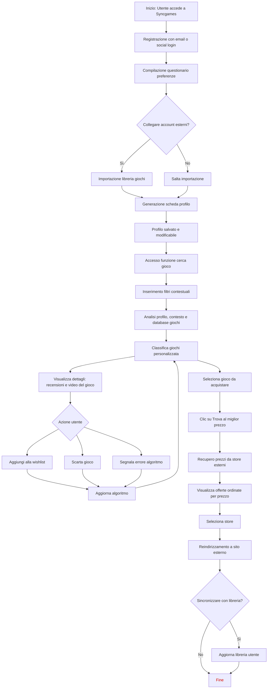

```mermaid

flowchart TD
    A["Inizio: Utente accede a Syncgames"] --> B["Registrazione con email o social login"]
    B --> C["Compilazione questionario preferenze"]
    C --> D{"Collegare account esterni?"}
    D -- Sì --> E["Importazione libreria giochi"]
    D -- No --> F["Salta importazione"]
    E --> G["Generazione scheda profilo"]
    F --> G
    G --> H["Profilo salvato e modificabile"]
    H --> I["Accesso funzione cerca gioco"]
    I --> J["Inserimento filtri contestuali"]
    J --> K["Analisi profilo, contesto e database giochi"]
    K --> L["Classifica giochi personalizzata"]
    L --> M["Visualizza dettagli: recensioni e video del gioco"] & S["Seleziona gioco da acquistare"]
    M --> N{"Azione utente"}
    N --> O["Aggiungi alla wishlist"] & P["Scarta gioco"] & Q["Segnala errore algoritmo"]
    O --> R["Aggiorna algoritmo"]
    P --> R
    Q --> R
    R --> L
    S --> T["Clic su Trova al miglior prezzo"]
    T --> U["Recupero prezzi da store esterni"]
    U --> V["Visualizza offerte ordinate per prezzo"]
    V --> W["Seleziona store"]
    W --> X["Reindirizzamento a sito esterno"]
    X --> Y{"Sincronizzare con libreria?"}
    Y -- Sì --> Z["Aggiorna libreria utente"]
    Y -- No --> FINE["Fine"]
    Z --> FINE
    style FINE color:#D50000
```