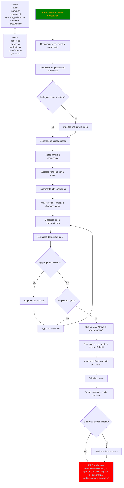

```mermaid
flowchart TD
    U["Utente<br/>- età int<br/>- nome str<br/>- cognome str<br/>- genere_preferito str<br/>- email str<br/>- password str"]
    GIOCO["Gioco<br/>- genere str<br/>- durata str<br/>- preferito str<br/>- piattaforma str<br/>- grafica str"]
    U <--> GIOCO
    A["Inizio: Utente accede a Syncgames"] --> B["Registrazione con email o social login"]
    B --> C["Compilazione questionario preferenze"]
    C --> D{"Collegare account esterni?"}
    D -- Sì --> E["Importazione libreria giochi"]
    D -- No --> G["Generazione scheda profilo"]
    E --> G
    G --> H["Profilo salvato e modificabile"]
    H --> I["Accesso funzione cerca gioco"]
    I --> J["Inserimento filtri contestuali"]
    J --> K["Analisi profilo, contesto e database giochi"]
    K --> L["Classifica giochi personalizzata"]
    L --> M["Visualizza dettagli del gioco"]
    M --> N{"Aggiungere alla wishlist?"}
    N -- Sì --> O["Aggiunto alla wishlist"]
    N -- No --> P{"Acquistare il gioco?"}
    O --> R["Aggiorna algoritmo"]
    P -- Sì --> S["Clic sul tasto ''Trova al miglior prezzo''"]
    P -- No --> R
    S --> T["Recupero prezzi da store esterni affidabili"]
    T --> U1["Visualizza offerte ordinate per prezzo"]
    U1 --> V["Seleziona store"]
    V --> W["Reindirizzamento a sito esterno"]
    W --> X{"Sincronizzare con libreria?"}
    X -- Sì --> Y["Aggiorna libreria utente"]
    X -- No --> Z["FINE. (hai usato correttamente GameSync, speriamo di averti regalato un esperienza soddisfacente e piacevole.)"]
    Y --> Z
    R --> L
    style Z fill:red,color:lightblue
    style A fill:green,color:orange
```